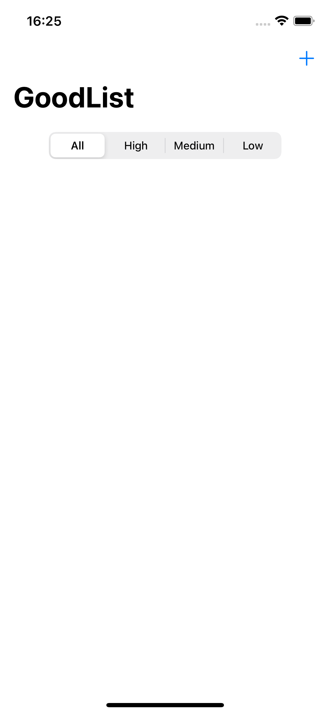

# GoodList
> Aplicativo para desenvolvimento RxSwift

* Recursos estudados
    * Observables
        * Observables
        * Subscriptions
        * Diposing and Terminating

    * Subjects
        * Publish Subjects
        * Observables
        * Variable [deprecated]
        * BehaviorRelay
 
## Snapshots

  
 

 
  

  
 

 
  

 
  

 
  
